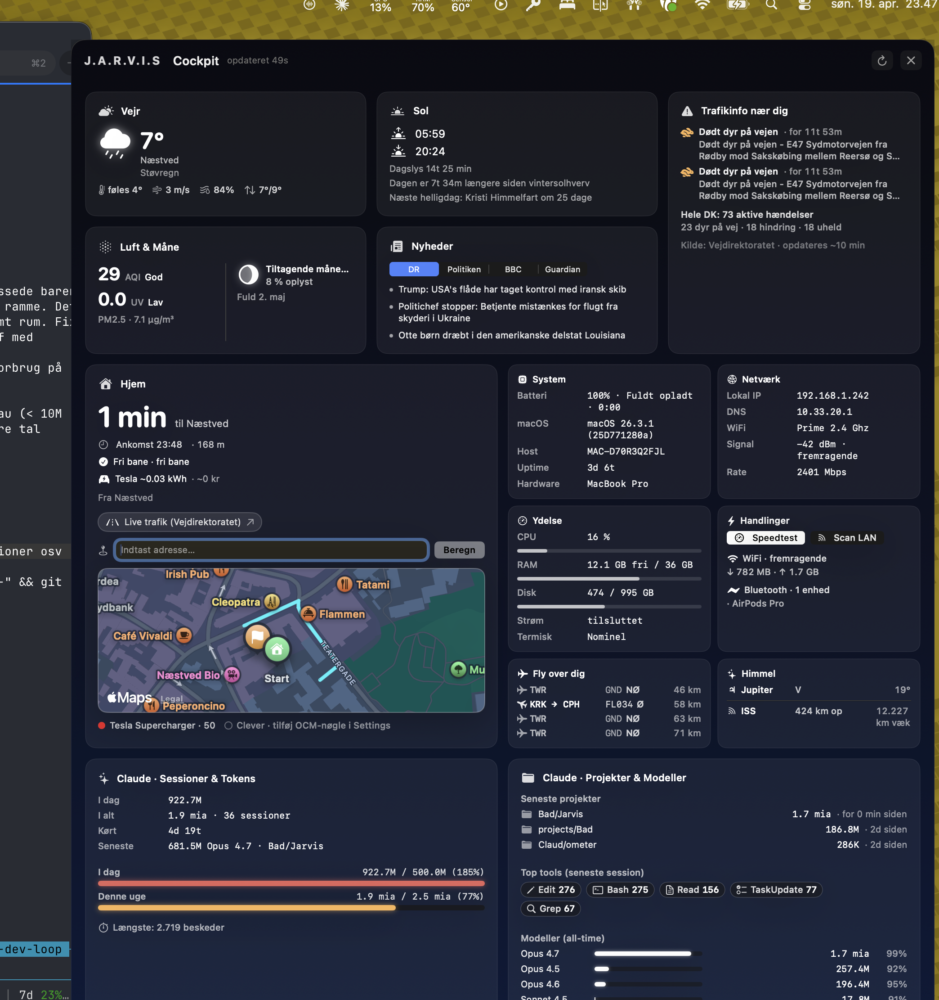
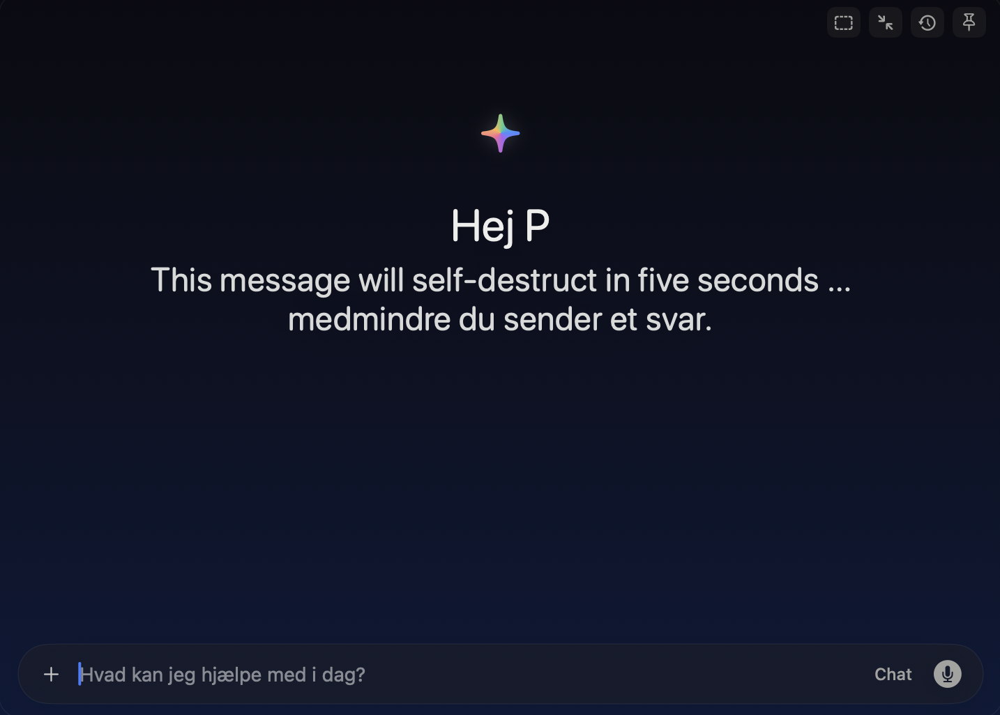
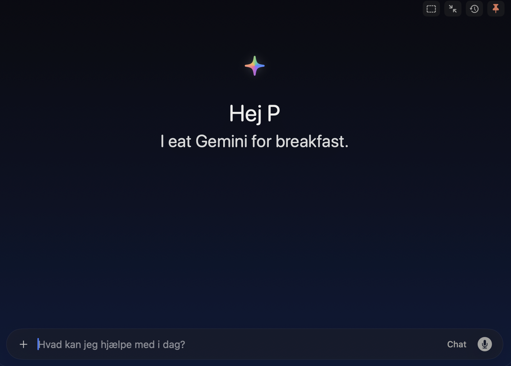

# Jarvis — AI Voice Assistant for macOS

A native macOS menu-bar app that turns your voice into action using Google Gemini + Anthropic Claude. Push-to-talk for dictation or a web-grounded answer; open the **Ultron** unified window for a glanceable Cockpit, live Voice HUD, and full Chat with conversation history — all in one panel.



## What's new in v2.0

The **Ultron redesign** (April 2026) collapses Jarvis's three separate corner panels into one unified window with three tabs:

- **Cockpit** · 9-tile live dashboard (weather, sun, air, commute, traffic, aircraft, news, system, network, Claude Code)
- **Voice** · real-time waveform + decibel meter, dictation + Q&A flow, real microphone/speaker names from CoreAudio
- **Chat** · streaming agent replies, tool-call approvals, conversation history sidebar, live model + token + latency stats

One window. Three tabs. Keyboard `1 / 2 / 3` to switch. Working traffic-light buttons (red closes, yellow minimizes, green zooms). Tab-aware reload (`⟳`), settings gear (`⌘ ,`), and a sidebar slide (`⌘ [`) in chat.

See [`CHANGELOG.md`](CHANGELOG.md) for the full v2.0 change list.

## Highlights

- **Voice modes** — dictation (local Whisper large-v3), Q&A (Gemini + grounded search), vision (screen capture + prompt), VibeCode, professional rewrite. Push-to-talk with global hotkeys; all phases render live in the Voice tab.
- **Cockpit** — 9-tile editorial dashboard with live refresh (5 s / 15 s / 30 s cadences per tile family), weekday-aware "COCKPIT · MANDAGSBRIEFING" kicker, rotating 200-line greeting in the MORNING LINE side-card.
- **Chat** — full conversation history with streaming replies, agent mode with tool-call cards + inline approval prompts, drag-and-drop image attachments, semantic search, Spotlight indexing. Live stats chip shows the model, tokens in→out, and latency in ms.
- **Agent mode** — tool-using chat with file system, code execution, web search, MCP servers. Approval UI for destructive actions.
- **Jarvis URL scheme** — `jarvis://chat?prompt=…` / `qna` / `vision` / `summarize` / `info` / `briefing` for Shortcuts + automation.

## Voice Modes

| Mode | Hotkey | What it does | Output |
|------|--------|-------------|--------|
| **Dictation** | `⌥ Space` | Transcribes speech (local WhisperKit) to clean text | Paste at cursor + clipboard + Notes.app note |
| **VibeCode** | `⌥ Space` | Converts spoken ideas into structured AI coding prompts | Paste at cursor |
| **Professional** | `⌥ Space` | Rewrites dictation for professional communication | Paste at cursor |
| **Q&A** | `⌥ Q` | Grounded question answering with Gemini + web search + citation chips | Voice tab → Speaking state |
| **Vision** | `⌥ ⇧ Space` | Analyzes your screen + answers questions about it | Voice tab → Speaking state |

- **⌥ M** cycles modes · **⌥ Return** toggles Chat · **⌥ ⇧ I** opens Cockpit · **⌥ ⇧ B** opens Briefing (→ Cockpit tab in v2).
- All voice hotkeys are push-to-talk. Custom modes configurable in Settings.

Pressing a voice hotkey opens the Ultron window on the Voice tab automatically. If Ultron is already open, the tab flips live and the existing window stays put — no corner HUD, no secondary panel.

## Ultron unified window

The three tabs share the same panel, the same editorial navy palette, and the same top bar. Keyboard `1 / 2 / 3` switches tab; `?` opens the cheat sheet overlay.

### Cockpit tab

A dense, glanceable 4-section dashboard. Auto-refresh cadences are tuned per tile family — live system metrics every 5 s, Claude Code stats every 15 s, aircraft + ISS every 30 s, weather / news / commute on the 2-minute cycle.

| Section | Tiles |
|---------|-------|
| **Udenfor** | Vejr · Sol · Luft & Måne |
| **Din rute** | Hjem · Rute — Trafikinfo nær dig |
| **Over & omkring** | Fly over dig — Nyheder |
| **Din maskine** | System · Netværk · Claude Code |

| Tile | Content | Source |
|------|---------|--------|
| **Vejr** | Temperature, condition (italic serif), feels-like, **wind speed + 8-point compass direction** ("6 m/s NV"), humidity, today's high/low | Open-Meteo |
| **Sol** | Daylight length, live **sun arc chart** with current position, sunrise · transit · sunset row, next Danish holiday, solstice delta ("Forår · +3m 42s") | Pure Swift (`SolarDateMath`, `DanishHolidays`) |
| **Luft & Måne** | AQI + UV bands · moon phase + illumination + next full moon | Open-Meteo + pure-Swift ephemeris |
| **Hjem · Rute** | Travel time, ETA, traffic delay, Tesla kWh + kr estimate, destination weather, live-traffic MapKit view with charger overlays | Apple Maps + Open-Meteo + supercharge.info + Open Charge Map |
| **Trafikinfo nær dig** | Up to 5 nearby events with icon badges (accident / animal / obstruction / road-condition / public-event tint), municipal reporter + relative-time chips, national aggregate footer | Vejdirektoratet DATEX II feed |
| **Fly over dig** | 3 nearest aircraft — route label, callsign · type, flight level + metres, km + bearing, 28×28 compass rose with needle rotated to bearing | adsb.lol + adsbdb.com |
| **Nyheder** | 4 most-recent headlines across DR / Politiken / BBC / Guardian / Reddit / Hacker News, tap to open | RSS feeds |
| **System** | Host, macOS version, chip, uptime, battery + CPU / RAM / Disk bars | `sysctl`, `pmset`, ProcessInfo, FileManager |
| **Netværk** | SSID, signal (dBm), link rate (Mbps / Gbps auto), local IP, DNS, Bluetooth status + RX / TX / Loss bars | `getifaddrs`, `scutil`, IOBluetooth |
| **Claude Code** | 2×2 stat grid (Sessioner · Tokens i alt · I dag · Sidste uge), per-model cache-hit bars, live indicator | Live sweep of `~/.claude/projects/*/*.jsonl` |

Hjem · Rute, Trafik, and Fly render a **"Venter på lokation…"** placeholder on cold start instead of em-dash holes — CoreLocation typically resolves within 2 s.

### Voice tab

- Live RMS meter + 48-bar waveform pulsing whenever audio arrives — runs as a background mic-monitor the moment the tab is active, not only during push-to-talk
- State labels track the real pipeline: `Klar · ⌥ Space` / `Lytter · DIKTERING` / `Tænker · SPØRG · GEMINI` / `Taler · SPØRG · GEMINI`
- Real device names from CoreAudio HAL — "Mik: MacBook Pro Microphone · Højtaler: MacBook Pro Speakers · Støj: −42 dB"
- Per-turn stats — "Model: gemini-2.5-flash · Tokens: 127 → 342 · Svar: 820 ms"
- **"Send til chat"** pill appears when the transcript is non-empty — tap to land the question in Chat as a user message and switch tabs

### Chat tab

- Streaming replies with live pulsing indicator in the header
- Conversation history in a left sidebar — full-text + semantic search (NLEmbedding), grouped "I dag" / "Tidligere" by `Calendar.isDateInToday`, right-click to delete
- Sidebar slide-in/out animated (`⌘ [`); state persisted across launches
- Tool-call cards in agent mode — icon + name + input summary + success/fail badge + duration
- Inline image preview on drag-drop
- Citation chips for web-search results (number badge + host + arrow.up.right)
- Pending-confirmation cards for destructive agent tools — **`⌘ ↵` approves, `Esc` rejects**
- Live stats chip next to the header: model, tokens in→out, latency in ms
- Rotating greeting on empty state — 200-line curated library with `Hej P` preheader

Anthropic prompt caching (`cache_control: ephemeral`) is active on agent-mode system prompts — roughly 2× cost reduction on long tool loops.

## Chat empty-state greetings

Every fresh chat lands on a rotating one-liner from `GreetingProvider` — film quotes, sci-fi nods, butler banter, Jarvis-specific jabs. Same library powers the Cockpit's MORNING LINE side-card.

<p align="center">
  
  
  
</p>

## Tech stack

| Component | Technology |
|-----------|-----------|
| Language | Swift 6.3 |
| UI | SwiftUI + AppKit hybrid (unified NSPanel + SwiftUI root) |
| AI backends | Google Gemini 2.5 Flash / Pro + Anthropic Claude Opus / Sonnet / Haiku |
| Local STT | WhisperKit (openai_whisper-large-v3-v20240930_turbo_632MB) |
| Audio | `AVAudioEngine` (WAV/PCM) + `SharedAudioEngine` pub/sub |
| Hotkeys | [HotKey](https://github.com/soffes/HotKey) package |
| Text insertion | Accessibility API (AXUIElement) + Pasteboard fallback |
| Screen capture | ScreenCaptureKit |
| Maps | MapKit (live traffic + off-peak baseline for commute delta) |
| Location | CoreLocation (60 s cache + reverse-geocoded city) |
| Audio devices | CoreAudio HAL (default input/output name polling) |
| Semantic search | Apple NLEmbedding (on-device) |
| Spotlight | CoreSpotlight (`CSSearchableItem` per conversation) |
| Bluetooth | IOBluetooth (requires `NSBluetoothAlwaysUsageDescription`) |
| System probes | `host_statistics64`, IOKit `AppleSmartBattery`, `getifaddrs`, `sysctl hw.model` |
| TTS | AVSpeechSynthesizer |
| Persistence | Keychain (API keys) + JSON files (conversations / modes / metrics / usage) |
| Fonts | Source Serif 4 (VF) + Geist + JetBrains Mono, bundled via `ATSApplicationFontsPath` |
| Target | macOS 14.0+ |

## Project structure

```
Jarvis/
├── JarvisApp.swift                      # App entry point
├── AppDelegate.swift                    # Menu bar + pipeline wiring
├── Constants.swift                      # App version + spacing/timing constants
│
├── Gemini/                              # Gemini + Anthropic chat clients
│   ├── GeminiClient.swift
│   ├── ChatSession.swift
│   ├── AnthropicProvider.swift
│   └── UsageTracker.swift               # Per-turn + monthly stats
│
├── Agent/                               # Tool-using agent mode
│   ├── AgentService.swift
│   ├── AgentTool.swift
│   ├── Tools/                           # SearchFilesTool, RunShellTool, …
│   └── MCP/                             # MCPClient — external tool servers
│
├── Audio/
│   ├── SharedAudioEngine.swift          # Pub/sub tap manager
│   ├── AudioCaptureManager.swift        # WAV writer subscriber
│   ├── AudioLevelMonitor.swift          # RMS @Observable
│   ├── WaveformBuffer.swift             # 200-bucket rolling strip
│   ├── AudioDeviceInfo.swift            # CoreAudio default input/output
│   └── SpeechRecognitionService.swift
│
├── Modes/                               # Dictation / Q&A / Vision / custom
│
├── System/                              # Hotkeys, text insertion, location, focus
│
├── UI/                                  # Ultron unified window
│   ├── UltronMainWindow.swift           # 3-tab shell (Cockpit / Voice / Chat)
│   ├── UltronTopBar.swift               # Traffic lights, tabs, live-pill, gear
│   ├── UltronCockpitView.swift          # 4-section dashboard
│   ├── UltronVoiceView.swift            # Waveform + decibel HUD
│   ├── UltronChatView.swift             # Agent chat + sidebar
│   ├── UltronTile.swift                 # Tile primitive + BigNumber + KV grid
│   ├── UltronVejrTile.swift             #
│   ├── UltronSolTile.swift              # + SunArcView
│   ├── UltronLuftMaaneTile.swift        #
│   ├── UltronHjemRuteTile.swift         #
│   ├── UltronTrafikInfoTile.swift       #
│   ├── UltronFlyTile.swift              #
│   ├── UltronNyhederTile.swift          #
│   ├── UltronSystemTile.swift           #
│   ├── UltronNetvaerkTile.swift         #
│   ├── UltronClaudeCodeTile.swift       #
│   ├── HUDWindow.swift                  # NSPanel host
│   ├── CommuteMapView.swift             # MapKit with charger overlays
│   ├── SettingsView.swift · SettingsHost.swift
│   ├── JarvisTheme+Ultron.swift         # Palette + typography
│   └── GreetingProvider.swift           # 200-line rotating library
│
├── Services/                            # Cockpit data orchestrators
│   ├── InfoModeService.swift            # Root Cockpit coordinator
│   ├── WeatherService.swift             # Open-Meteo (+ wind_direction_10m)
│   ├── NewsService.swift                # RSS
│   ├── CommuteService.swift             # Apple Maps routing
│   ├── SystemInfoService.swift          # OS / network / bluetooth probes
│   ├── AirQualityService.swift
│   ├── MoonService.swift
│   ├── SolarDateMath.swift              # Pure Swift solar math
│   ├── DanishHolidays.swift             # Gauss Easter + fixed dates
│   ├── PlanetEphemeris.swift            # Pure Swift planet ephemeris
│   ├── AircraftService.swift            # adsb.lol + adsbdb route resolver
│   ├── ISSService.swift                 # wheretheiss.at
│   ├── TrafficEventsService.swift       # Vejdirektoratet DATEX II
│   ├── ChargerService.swift             # Tesla Supercharger + Clever
│   ├── ClaudeStatsService.swift         # Claude Code usage aggregator
│   ├── HistoryService.swift             # This-day-in-history (Wikipedia)
│   ├── ChatPipeline.swift · AgentChatPipeline.swift · ChatCommandRouter.swift
│   ├── ConversationStore.swift
│   └── …
│
├── JarvisWidgetExtension/               # Notification Center widgets
│
└── Resources/
    ├── Assets.xcassets
    ├── Fonts/                           # Source Serif 4 + Geist + JetBrains Mono
    ├── Info.plist                       # LSUIElement + usage descriptions
    └── Jarvis.entitlements
```

## Installation

### From DMG
1. Download `Jarvis-2.0.0.dmg` from [Releases](https://github.com/Parthee-Vijaya/JarvisHUD/releases)
2. Open the DMG and drag Jarvis to Applications
3. Launch Jarvis from Applications

### Build from source
```bash
git clone git@github.com:Parthee-Vijaya/JarvisHUD.git
cd JarvisHUD
./create-dev-signing-cert.sh        # one-shot, stable Keychain grants
./run-dev.sh                        # Debug build + launch
# or
xcodebuild -scheme Jarvis -configuration Release build
./build-dmg.sh                      # Release DMG
```

Requirements: Xcode 26+, macOS 14+ SDK, Swift 6.3.

The `create-dev-signing-cert.sh` script installs a persistent self-signed code-signing identity ("Jarvis Dev") so macOS Keychain "Always Allow" grants survive rebuilds — without it the Gemini API-key prompt returns on every launch.

If Notification Center widgets get stuck on placeholder data after a build, run `./fix-widget-cache.sh` to purge DerivedData + re-register the fresh `.app` with Launch Services.

## Setup

1. Launch — the onboarding walks you through permissions (Mic · Accessibility · Screen capture · Speech · Location · Calendar · Bluetooth).
2. Menu bar icon → **Indstillinger** → paste **Gemini** + **Anthropic** API keys → **Save** + **Test**.
3. Optional: add an **Open Charge Map** key in Settings to enable Clever chargers on the commute map (Tesla Superchargers work without any key).
4. Set your **home address** in Settings for the Cockpit's Hjem · Rute tile.

API keys live in Keychain, never on disk.

## Keyboard shortcuts

| Shortcut | Action |
|----------|--------|
| `⌥ Space` | Dictation / VibeCode / Professional (push-to-talk) |
| `⌥ Q` | Q&A mode (push-to-talk) |
| `⌥ ⇧ Space` | Vision mode (push-to-talk) |
| `⌥ M` | Cycle mode |
| `⌥ Return` | Toggle Chat |
| `⌥ ⇧ I` | Toggle Cockpit |
| `⌥ ⇧ B` | Toggle Briefing (→ Cockpit tab) |
| `1 / 2 / 3` (in Ultron) | Switch tab Cockpit / Voice / Chat |
| `⌘ K` (in Ultron) | Tool palette |
| `⌘ [` (in Chat) | Toggle conversation sidebar |
| `⌘ ,` (in Ultron) | Settings |
| `⌘ N` (in Chat) | New conversation |
| `⌘ ↵` (on pending tool) | Approve agent action |
| `Esc` (on pending tool) | Reject agent action |
| `?` (in Ultron) | Hotkey cheat sheet overlay |

## Data & privacy

- **API keys** in macOS Keychain
- **Audio** captured in memory only — never saved
- **Screenshots** (Vision) held in memory for the API round-trip, then discarded
- **Logs** at `~/Library/Logs/Jarvis/jarvis.log` (rolled at 10 MB)
- **Metrics** at `~/Library/Logs/Jarvis/metrics.jsonl`
- **Conversations** at `~/Library/Application Support/Jarvis/conversations/*.json`
- **Usage data** at `~/Library/Application Support/Jarvis/usage.json`
- **Stats-cache** is read-only from `~/.claude/stats-cache.json` (written by Claude Code)

All public data calls (weather, traffic, chargers, ADS-B, ISS, Open Charge Map, Vejdirektoratet) are unauthenticated and see only your approximate coordinate. LLM calls go to Google / Anthropic.

## License

MIT

---

Built with Claude Code. See `CHANGELOG.md` for release history.
